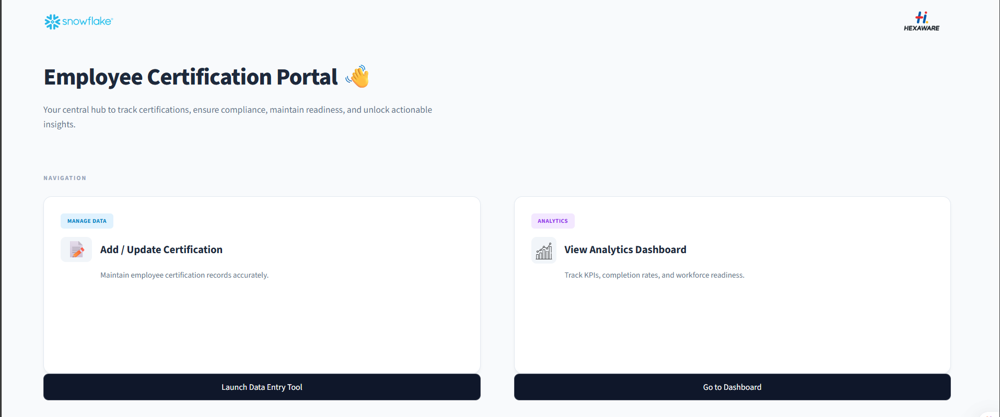
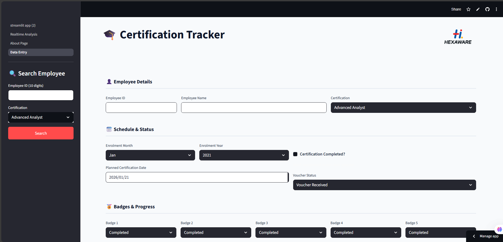

**🎓 Certification Tracker**

**Overview**

Certification Tracker is an internal web application developed for Hexaware Technologies to enable structured data entry, tracking, and visualization of employee certification progress.

The application is designed to streamline certification management by combining guided data entry with analytical views that support monitoring, review, and decision-making.

⚠️_ This repository does not contain any confidential or production data and is intended strictly for internal organizational use.
_
****Application Views****
**Welcome Page**

1.Serves as the entry point to the application

2.Provides a clear overview of the purpose of the Certification Tracker

3.Guides users to relevant sections of the application

**Certification Management Page**
1.Allows users to add, search, update, and delete certification records

2.Supports structured capture of certification schedules, completion status, and preparation progress

3.Ensures controlled data entry through validations and guided workflows

**Analysis & Visualization Page**
1.Presents aggregated views of certification progress

2.Enables visual monitoring of certification status across tracks

3.Supports high-level insights without exposing underlying data details

**Core Capabilities**

1.Structured Data Entry

  Standardized input fields for certification-related information
  
  Logical grouping of fields to improve usability and clarity

2.Real-Time Validation

  Immediate detection of duplicate employee–certification entries
  
  Mandatory field enforcement to prevent incomplete submissions

3.Controlled Data Modification

  Clear separation between record creation and record updates
  
  Update operations restricted to records loaded through search

4.Input Normalization

  Automatic handling of empty or whitespace-only inputs
  
  Ensures consistent data representation for downstream analysis

5.User Guidance & Feedback

  Contextual error and warning messages
  
  Dynamic enablement of actions based on validation state

6.Review Before Persistence

  Final verification step prior to saving data
  
  Reduces risk of accidental or incorrect submissions

**Technology Stack**

1.Programming Language: Python

2.User Interface: Streamlit

3.Data Processing: Pandas

4.Backend Integration: Snowflake (via Snowpark)

📸 Screenshots

_Screenshots are for UI reference only. All displayed information is anonymized and does not contain confidential or production data._

Welcome Page

Certification Management

Analysis & Visualization

**Intended Usage**
The Certification Tracker is intended to:

1.Centralize certification-related data entry

2.Improve visibility into certification progress

3.Support internal reporting and analytics

4.Reduce manual tracking and inconsistencies

**Security & Confidentiality**

  This repository does not include sensitive or proprietary data
  
  Business rules and schemas are intentionally abstracted
  
  The application is designed for controlled internal environments only

**Deployment Notes**

  Requires appropriate internal access and configuration
  
  Intended for deployment within organizational infrastructure
  
  Not designed for public or external usage

**Ownership**
  
  Developed for Hexaware Technologies as part of an internal initiative to improve certification tracking, monitoring, and visualization.
